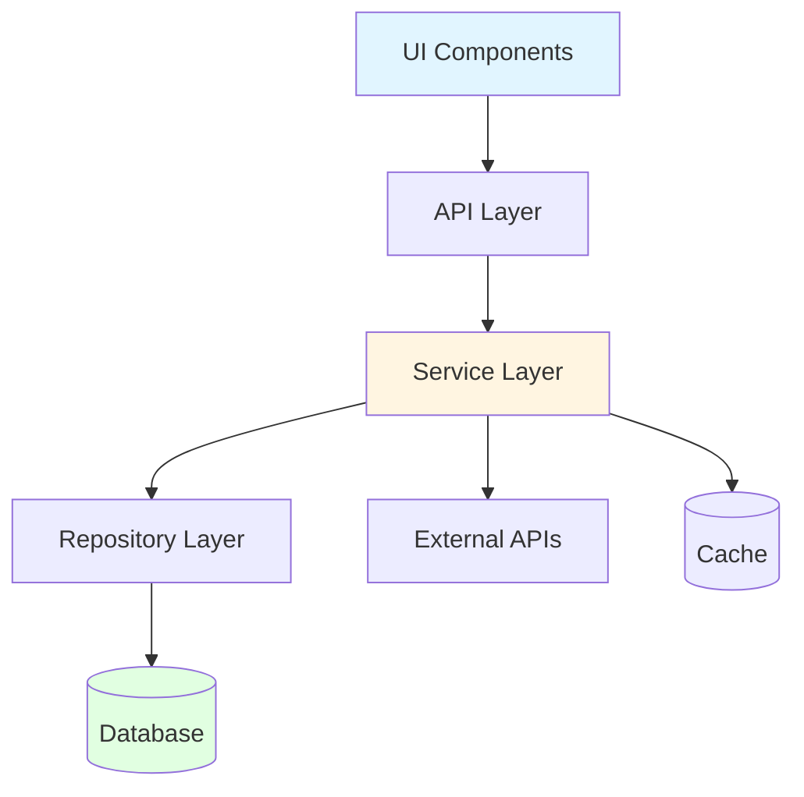
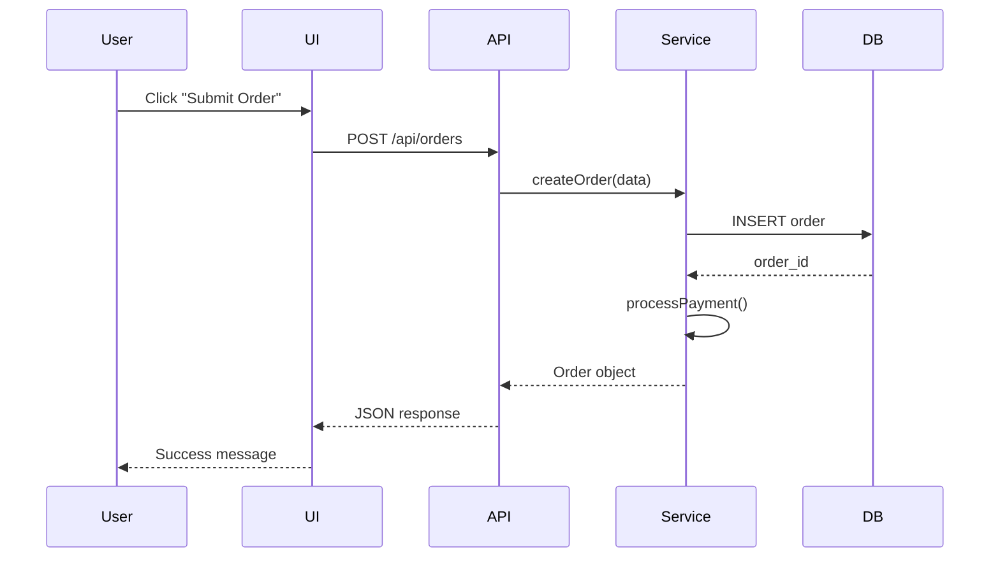
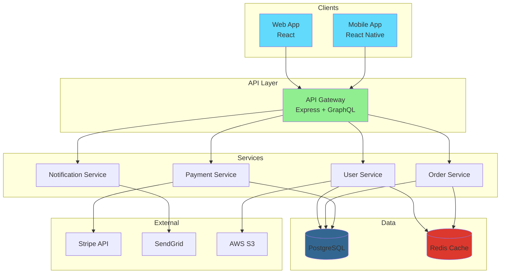

# Architectural Analysis

## Understanding and Documenting Software Architecture with Claude

---

## 🎯 Learning Objectives

By the end of this section, you will be able to:

- ✅ Analyze and understand software architecture patterns quickly
- ✅ Identify architectural layers and their responsibilities
- ✅ Map dependencies and relationships between components
- ✅ Create comprehensive architecture documentation
- ✅ Generate architecture diagrams using Mermaid
- ✅ Evaluate architectural decisions and trade-offs
- ✅ Identify technical debt and improvement opportunities
- ✅ Design new features that align with existing architecture

---

## 📖 Understanding Software Architecture

### What is Architecture Analysis?

Software architecture is the high-level structure of a software system - the blueprint that defines:
- **Components:** Major building blocks and modules
- **Relationships:** How components interact and depend on each other
- **Principles:** Design patterns and architectural decisions
- **Constraints:** Technical and business limitations
- **Quality Attributes:** Performance, scalability, maintainability goals

### Why Architecture Analysis Matters

**For New Team Members:**
- Understand system structure quickly
- Know where to make changes
- Avoid breaking architectural principles
- Contribute effectively from day one

**For Feature Development:**
- Design features that fit architecture
- Identify integration points
- Understand impact of changes
- Make informed technical decisions

**For Technical Debt:**
- Identify problem areas
- Plan refactoring efforts
- Justify modernization
- Improve system quality

---

## 🏗️ Common Architecture Patterns

### Layered Architecture

**Structure:**
```
┌─────────────────────┐
│  Presentation Layer │ (UI, Controllers)
├─────────────────────┤
│   Business Layer    │ (Services, Logic)
├─────────────────────┤
│ Data Access Layer   │ (Repositories, ORM)
├─────────────────────┤
│   Database Layer    │ (SQL, NoSQL)
└─────────────────────┘
```

**Analysis Prompt:**
```
Analyze this codebase structure and identify if it follows layered architecture:

Directory structure:
```
src/
├── controllers/
├── services/
├── repositories/
├── models/
└── database/
```

Key files:
[paste sample files from each directory]

Identify:
1. Is this truly layered architecture?
2. What are the responsibilities of each layer?
3. Are there any layer violations (bypassing layers)?
4. How well are layers separated?
5. Suggested improvements?
```

### Microservices Architecture

**Structure:**
```
┌──────────┐  ┌──────────┐  ┌──────────┐
│ Service  │  │ Service  │  │ Service  │
│    A     │  │    B     │  │    C     │
└────┬─────┘  └────┬─────┘  └────┬─────┘
     │             │             │
     └─────────────┴─────────────┘
              │
         ┌────▼────┐
         │   API   │
         │ Gateway │
         └─────────┘
```

**Analysis Prompt:**
```
Analyze this monorepo structure for microservices patterns:

Repository structure:
```
services/
├── user-service/
│   ├── src/
│   ├── tests/
│   └── package.json
├── order-service/
│   ├── src/
│   ├── tests/
│   └── package.json
├── payment-service/
│   ├── src/
│   ├── tests/
│   └── package.json
└── api-gateway/
```

Analyze:
1. How do services communicate?
2. What's shared vs. service-specific?
3. How is data managed across services?
4. Are service boundaries well-defined?
5. What integration patterns are used?
```

### MVC (Model-View-Controller)

**Structure:**
```
┌─────────┐      ┌──────────────┐      ┌───────┐
│  View   │◄─────│  Controller  │─────►│ Model │
└─────────┘      └──────────────┘      └───────┘
     │                                      │
     └──────────────────────────────────────┘
                   Updates
```

**Analysis Prompt:**
```
Analyze this web application for MVC pattern:

Structure:
```
src/
├── views/
│   ├── UserView.tsx
│   └── OrderView.tsx
├── controllers/
│   ├── UserController.ts
│   └── OrderController.ts
└── models/
    ├── User.ts
    └── Order.ts
```

Sample files:
[paste one file from each directory]

Evaluate:
1. Is MVC properly implemented?
2. Are responsibilities clearly separated?
3. Is there any view logic in controllers?
4. Is there any business logic in views?
5. How well does it follow MVC principles?
```

### Clean Architecture / Hexagonal Architecture

**Structure:**
```
┌─────────────────────────────────────┐
│         External Interfaces         │
│  (API, UI, Database, External APIs) │
├─────────────────────────────────────┤
│         Adapters/Interfaces         │
│   (Controllers, Repositories, etc.) │
├─────────────────────────────────────┤
│         Use Cases/Application       │
│      (Business Logic/Services)      │
├─────────────────────────────────────┤
│            Domain/Entities          │
│        (Core Business Models)       │
└─────────────────────────────────────┘
```

**Analysis Prompt:**
```
Analyze if this codebase follows Clean Architecture principles:

Directory structure:
```
src/
├── domain/
│   └── entities/
├── application/
│   └── usecases/
├── infrastructure/
│   ├── database/
│   └── external/
└── interfaces/
    ├── api/
    └── web/
```

Verify:
1. Are dependencies pointing inward?
2. Is domain logic independent of frameworks?
3. Are use cases clearly defined?
4. How are external dependencies managed?
5. Is the architecture testable?
```

---

## 🔍 Analyzing Existing Architecture

### Step 1: High-Level Structure Identification

#### Prompt Template: Architecture Pattern Recognition

```
Analyze this repository and identify its architectural pattern:

Repository structure:
[paste tree output]

Sample files from key directories:
[paste 3-5 representative files]

Identify:
1. What architectural pattern is used? (Layered, MVC, Microservices, Clean, etc.)
2. What are the main components/modules?
3. How are components organized?
4. What are the key design decisions?
5. How well is the pattern implemented?

Provide a concise architecture summary.
```

### Step 2: Component Relationship Mapping

#### Prompt Template: Dependency Analysis

```
Map the relationships between components in this system:

Component A: [description + sample file]
Component B: [description + sample file]
Component C: [description + sample file]

Analyze:
1. How does A depend on B?
2. How does B depend on C?
3. Are there circular dependencies?
4. What's the dependency direction?
5. Which components are most coupled?

Create a dependency diagram in Mermaid format.
```

**Example Response:**


### Step 3: Data Flow Analysis

#### Prompt Template: Data Flow Mapping

```
Trace the data flow for this operation: [describe operation]

Relevant files:
[paste files involved in the operation]

Map out:
1. Where does data originate?
2. How is it transformed at each step?
3. What components handle the data?
4. Where is data persisted?
5. What's the response flow?

Create a sequence diagram showing the complete flow.
```

**Example Sequence Diagram:**


---

## 📊 Creating Architecture Documentation

### Architecture Decision Records (ADRs)

#### Template: Creating ADR with Claude

```
Create an Architecture Decision Record for this decision:

Context:
We need to choose between REST and GraphQL for our API

Options Considered:
1. REST API
2. GraphQL
3. Hybrid approach

Decision Made: GraphQL

Generate an ADR document including:
1. Status (Accepted)
2. Context and problem statement
3. Decision drivers
4. Options considered with pros/cons
5. Decision outcome
6. Consequences (positive and negative)
7. Related decisions/documents

Follow ADR format standards.
```

**Generated ADR Example:**
```markdown
# ADR-001: Use GraphQL for API Layer

## Status
Accepted - 2026-05-05

## Context
We need a flexible API layer for our mobile and web applications that:
- Reduces over-fetching of data
- Supports complex nested queries
- Provides strong typing
- Enables rapid frontend development

## Decision Drivers
- Mobile app needs minimal data transfer
- Complex relationships between entities
- Multiple clients with different data needs
- Team familiar with TypeScript
- Need for API documentation

## Options Considered

### Option 1: REST API
**Pros:**
- Well-understood pattern
- Simple to implement
- Good tooling support
- HTTP caching built-in

**Cons:**
- Over-fetching problems
- Multiple round trips needed
- Versioning challenges
- Rigid endpoint structure

### Option 2: GraphQL
**Pros:**
- Precise data fetching
- Single endpoint
- Strong typing with schemas
- Self-documenting
- Excellent developer experience

**Cons:**
- Learning curve
- Caching complexity
- Query complexity management needed
- Potential N+1 query problems

### Option 3: Hybrid (REST + GraphQL)
**Pros:**
- Flexibility
- Gradual migration

**Cons:**
- Maintenance overhead
- Confusion about which to use when
- Increased complexity

## Decision
We will use GraphQL for our API layer.

## Consequences

**Positive:**
- Reduced mobile data usage (30-50% savings expected)
- Faster frontend development
- Better developer experience with strong typing
- Single source of truth for API schema
- Easier to add new fields without breaking changes

**Negative:**
- Team needs GraphQL training
- Need to implement DataLoader for N+1 prevention
- Caching strategy more complex than REST
- Monitoring and error handling differs from REST

## Implementation Notes
- Use Apollo Server for backend
- Use Apollo Client for frontend
- Implement DataLoader from day one
- Set up query complexity limits
- Create GraphQL code generator for TypeScript
```

### System Architecture Diagram

#### Prompt Template: Generate Architecture Diagram

```
Create a comprehensive architecture diagram for this system:

Components:
1. Frontend: React web app
2. Mobile: React Native app
3. API Gateway: Express/GraphQL
4. Services: User, Order, Payment, Notification
5. Databases: PostgreSQL, Redis
6. External: Stripe, SendGrid, AWS S3

Create a Mermaid diagram showing:
1. All components and their relationships
2. Data flow between components
3. External integrations
4. Database connections
5. Key technologies used

Include proper styling and grouping.
```

**Generated Diagram:**


### Component Responsibility Matrix

```
Create a component responsibility matrix:

Components:
[list all major components]

For each component, document:
1. Primary responsibilities
2. Key functions/methods
3. Dependencies (what it uses)
4. Dependents (what uses it)
5. Data it manages
6. External integrations

Present as a markdown table.
```

**Generated Matrix:**
```markdown
| Component | Responsibilities | Dependencies | Owned Data | External Integrations |
|-----------|-----------------|--------------|------------|----------------------|
| User Service | User CRUD, Authentication, Profile management | Database, Cache, S3 | Users, Profiles, Sessions | AWS S3 for avatars |
| Order Service | Order processing, Inventory, Order history | Database, Cache, Payment Service | Orders, LineItems, Inventory | None |
| Payment Service | Payment processing, Refunds, Invoicing | Database, Order Service | Transactions, Invoices | Stripe |
| Notification Service | Email, SMS, Push notifications | Database, User Service | Templates, Notification history | SendGrid, Twilio |
```

---

## 🔬 Deep Architecture Analysis

### Identifying Design Patterns

```
Analyze this codebase and identify design patterns used:

Sample files:
[paste representative code showing patterns]

Identify and explain:
1. Which design patterns are used? (Singleton, Factory, Observer, etc.)
2. Where are they implemented?
3. Are they used correctly?
4. Are there anti-patterns?
5. Missing patterns that would help?

For each pattern found, show the code example and explain its purpose.
```

### Evaluating Architectural Decisions

```
Evaluate the architectural decisions in this system:

Architecture overview:
[paste architecture description]

Sample implementation:
[paste key code samples]

Evaluate:
1. **Separation of Concerns:** How well are responsibilities separated?
2. **Coupling:** How tightly are components coupled?
3. **Cohesion:** How related are functions within components?
4. **Scalability:** Can this scale horizontally/vertically?
5. **Testability:** How easy is it to test?
6. **Maintainability:** How easy to modify and extend?

For each aspect, provide:
- Current state assessment
- Issues identified
- Recommendations for improvement
```

### Technical Debt Identification

```
Analyze this codebase for technical debt:

Repository info:
- Age: [years]
- Size: [LOC]
- Team size: [number]
- Main technologies: [list]

Sample code:
[paste samples showing potential issues]

Identify technical debt in:
1. **Architecture:** Violations of architectural principles
2. **Code Quality:** Duplication, complexity, poor naming
3. **Testing:** Low coverage, brittle tests
4. **Dependencies:** Outdated libraries, security issues
5. **Documentation:** Missing or outdated docs

For each debt item:
- Severity (High/Medium/Low)
- Impact on development
- Estimated effort to fix
- Recommended priority
```

---

## 🎯 Practical Workflows

### Workflow 1: New Project Architecture Analysis (1 hour)

```markdown
## Goal: Understand architecture of new project

### Step 1: Initial Structure Scan (15 min)
```bash
tree -L 3 -I 'node_modules|.git|dist' > structure.txt
cloc . --exclude-dir=node_modules,dist > stats.txt
```

Prompt:
"Analyze this project structure and codebase statistics:
[paste structure.txt and stats.txt]

Provide:
1. Architecture pattern identification
2. Technology stack summary
3. Key components and their purposes
4. Recommended exploration path"

### Step 2: Component Analysis (20 min)
Select 3-5 key components and analyze each:

Prompt for each:
"Analyze this component:
[paste component code]

Explain:
1. Responsibilities
2. Dependencies
3. Design patterns used
4. Integration points"

### Step 3: Data Flow Analysis (15 min)
Pick a key feature and trace data flow:

Prompt:
"Trace data flow for [feature]:
[paste relevant files]

Create sequence diagram showing complete flow"

### Step 4: Documentation (10 min)
Generate architecture documentation:

Prompt:
"Create architecture overview document including:
1. System diagram
2. Component descriptions
3. Key design decisions
4. Technology choices"
```

### Workflow 2: Architecture Documentation Creation

```markdown
## Goal: Document existing architecture

### Phase 1: Discovery
- Analyze repository structure
- Identify all major components
- Map dependencies
- Understand data flows

### Phase 2: Diagramming
Create these diagrams:
- [ ] High-level system architecture
- [ ] Component relationships
- [ ] Data flow for key features
- [ ] Deployment architecture
- [ ] Database schema

### Phase 3: Documentation
Write these documents:
- [ ] Architecture overview (1-2 pages)
- [ ] Component guide
- [ ] ADRs for key decisions
- [ ] Integration guide
- [ ] Onboarding guide

### Phase 4: Validation
- [ ] Review with team
- [ ] Verify accuracy
- [ ] Update as needed
- [ ] Maintain going forward
```

### Workflow 3: Architecture Refactoring Planning

```markdown
## Goal: Plan architecture improvements

### Step 1: Current State Analysis
Prompt:
"Analyze current architecture and identify issues:
[paste architecture info]

List:
1. Architecture violations
2. Coupling problems
3. Missing layers/components
4. Technical debt
5. Scalability concerns"

### Step 2: Target Architecture Design
Prompt:
"Design improved architecture that addresses:
[paste issues from Step 1]

Provide:
1. Target architecture diagram
2. Migration strategy
3. Breaking changes
4. Timeline estimate
5. Risk assessment"

### Step 3: Migration Planning
Prompt:
"Create detailed migration plan:

Current: [describe]
Target: [describe]

Include:
1. Phase-by-phase approach
2. Backward compatibility strategy
3. Testing approach
4. Rollback plans
5. Success criteria"
```

---

## 🏋️ Exercises

### Exercise 1: Open Source Architecture Analysis

**Difficulty:** Beginner  
**Time:** 90 minutes

**Task:**
1. Choose a popular open source project (React, Express, Next.js)
2. Analyze its architecture using Claude
3. Create architecture diagram
4. Write 2-page architecture overview
5. Identify 3 key design decisions and explain rationale

**Deliverable:** Architecture analysis document with diagrams

### Exercise 2: Architecture Pattern Implementation

**Difficulty:** Intermediate  
**Time:** 2 hours

**Task:**
1. Take a simple app with no clear architecture
2. Identify appropriate architecture pattern
3. Refactor into chosen pattern
4. Document architecture decisions
5. Create before/after diagrams

**Deliverable:** Refactored code + ADR + diagrams

### Exercise 3: Microservices Migration Plan

**Difficulty:** Advanced  
**Time:** 3 hours

**Task:**
1. Analyze a monolithic application
2. Identify microservice boundaries
3. Design microservices architecture
4. Create migration strategy
5. Identify challenges and solutions

**Deliverable:** Microservices design + migration plan

### Exercise 4: Technical Debt Assessment

**Difficulty:** Intermediate  
**Time:** 2 hours

**Task:**
1. Analyze a legacy codebase
2. Identify architectural technical debt
3. Categorize by severity and impact
4. Create remediation roadmap
5. Estimate effort and prioritize

**Deliverable:** Technical debt report + roadmap

---

## ✅ Best Practices

### Do's ✅

**Analysis:**
- ✅ Start with high-level structure before details
- ✅ Use diagrams to visualize architecture
- ✅ Document assumptions and decisions
- ✅ Validate understanding with team
- ✅ Consider non-functional requirements

**Documentation:**
- ✅ Keep documentation up to date
- ✅ Use standard diagram formats (Mermaid, PlantUML)
- ✅ Write ADRs for significant decisions
- ✅ Include context and rationale
- ✅ Make docs accessible to all team members

**Evaluation:**
- ✅ Consider trade-offs objectively
- ✅ Evaluate against quality attributes
- ✅ Identify both strengths and weaknesses
- ✅ Provide actionable recommendations
- ✅ Prioritize improvements by impact

### Don'ts ❌

**Analysis:**
- ❌ Don't skip understanding business context
- ❌ Don't assume patterns without verification
- ❌ Don't ignore non-functional requirements
- ❌ Don't analyze in isolation from team
- ❌ Don't overlook external dependencies

**Documentation:**
- ❌ Don't create docs and never update them
- ❌ Don't over-document obvious things
- ❌ Don't use proprietary diagram tools
- ❌ Don't write for yourself only
- ❌ Don't forget to explain "why"

**Evaluation:**
- ❌ Don't criticize without understanding context
- ❌ Don't recommend changes without justification
- ❌ Don't ignore practical constraints
- ❌ Don't forget about team capabilities
- ❌ Don't propose unrealistic refactorings

---

## 📚 Additional Resources

**Books:**
- "Software Architecture: The Hard Parts" by Ford et al.
- "Fundamentals of Software Architecture" by Richards & Ford
- "Clean Architecture" by Robert Martin
- "Domain-Driven Design" by Eric Evans

**Online Resources:**
- C4 Model for architecture diagrams
- arc42 template for architecture documentation
- ThoughtWorks Technology Radar
- Martin Fowler's architecture blog

**Tools:**
- Mermaid for diagrams
- PlantUML for UML diagrams
- Structurizr for C4 diagrams
- Draw.io for general diagrams

---

## 🎯 Key Takeaways

1. **Architecture Matters:** Good architecture enables agility, bad architecture creates drag

2. **Pattern Recognition:** Learn common patterns to understand systems faster

3. **Visual Communication:** Diagrams communicate architecture better than text

4. **Document Decisions:** ADRs preserve context and rationale

5. **Continuous Analysis:** Architecture evolves, keep analyzing and updating

6. **Use AI Strategically:** Claude excels at pattern recognition and documentation generation

7. **Think Quality Attributes:** Consider scalability, maintainability, testability

8. **Balance Trade-offs:** Every architectural decision involves trade-offs

9. **Validate Understanding:** Always verify architectural assumptions

10. **Share Knowledge:** Architecture documentation helps entire team

---

## ✅ Mastery Checklist

By the end of this section, you should be able to:

- [ ] Identify architectural patterns in any codebase
- [ ] Create comprehensive architecture diagrams using Mermaid
- [ ] Write effective Architecture Decision Records (ADRs)
- [ ] Analyze component relationships and dependencies
- [ ] Evaluate architectural quality and technical debt
- [ ] Design features that align with existing architecture
- [ ] Document architecture for team onboarding
- [ ] Use AI assistance to accelerate architecture analysis

---

**Next:** [Git Workflows →](./05-git-workflows.md)

---

*"Architecture is about the important stuff, whatever that is." - Ralph Johnson*

*Master architecture analysis, make better design decisions, build maintainable systems.*
