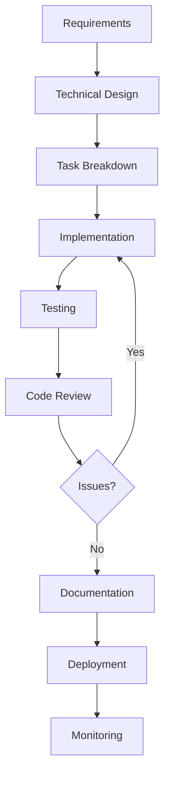

# Feature Development

## End-to-End Feature Implementation with Claude

---

## 🎯 Learning Objectives

By the end of this section, you will be able to:

- ✅ Design complete features from requirements to deployment
- ✅ Break down complex features into implementable tasks
- ✅ Implement full-stack features with AI assistance
- ✅ Ensure comprehensive test coverage for features
- ✅ Create feature documentation and technical specs
- ✅ Handle edge cases and error scenarios
- ✅ Coordinate frontend, backend, and database changes
- ✅ Validate features before deployment

---

## 📖 Understanding Feature Development

### What is a Complete Feature?

**Not a Feature (Code Snippet):**
```typescript
// Just a function
async function getUser(id: string) {
  return await db.users.findById(id);
}
```

**Complete Feature:**
```markdown
User Profile Management
├── Backend
│   ├── API endpoints (GET, PUT, DELETE /users/:id)
│   ├── Business logic (validation, permissions)
│   ├── Data models (User, Profile)
│   └── Error handling
├── Frontend
│   ├── Profile view component
│   ├── Edit profile form
│   ├── State management
│   └── Error handling UI
├── Tests
│   ├── Unit tests (services, components)
│   ├── Integration tests (API)
│   └── E2E tests (user flows)
├── Documentation
│   ├── API documentation
│   ├── User guide
│   └── Technical spec
└── Deployment
    ├── Database migrations
    ├── Environment variables
    └── Rollout plan
```

### The Feature Development Lifecycle



---

## 🎨 Phase 1: Requirements Analysis and Design

### Converting Requirements to Technical Specs

#### Prompt Template: Requirements Analysis

```
Analyze these requirements and create a technical specification:

**Feature Request:**
[paste product requirements, user story, or ticket description]

**Existing System:**
Technology Stack: [list technologies]
Architecture: [describe current architecture]
Constraints: [list any constraints]

Create:
1. **Feature Summary:** What we're building (2-3 sentences)
2. **User Stories:** Who needs this and why
3. **Technical Approach:** How to implement
4. **API Design:** Endpoints, requests, responses
5. **Data Model:** Database schema changes
6. **UI/UX Requirements:** Screen flows, interactions
7. **Dependencies:** What else needs to change
8. **Edge Cases:** What could go wrong
9. **Success Criteria:** How to validate

Make it specific and actionable.
```

#### Example: Email Notification System

**Input:**
```
Feature Request:
"Users should be able to configure email notifications for different events
(new messages, friend requests, mentions). They should be able to turn
notifications on/off for each type and choose immediate or daily digest."
```

**Claude's Technical Spec:**

```markdown
# Email Notification System - Technical Specification

## 1. Feature Summary
Implement a configurable email notification system allowing users to
subscribe to event-based notifications (messages, friend requests, mentions)
with options for immediate delivery or daily digest batching.

## 2. User Stories
- **As a user**, I want to choose which events trigger emails,
  so I only receive relevant notifications
- **As a user**, I want to choose between immediate or digest emails,
  so I can control email frequency
- **As a user**, I want to easily manage my preferences,
  so I can update them without hassle

## 3. Technical Approach

### Architecture
```
Event Occurs → Event Queue → Notification Service → Email Service → User
                 ↓
           User Preferences Check
```

### Components
- **NotificationPreferences Service:** Manage user settings
- **NotificationQueue:** Queue events for processing
- **EmailDigestJob:** Daily cron job for digest emails
- **EmailTemplates:** Event-specific email templates

## 4. API Design

### Endpoints

**Get User Preferences**
```http
GET /api/users/:userId/notification-preferences
Response: {
  "userId": "123",
  "preferences": {
    "newMessage": {
      "enabled": true,
      "delivery": "immediate"
    },
    "friendRequest": {
      "enabled": true,
      "delivery": "digest"
    },
    "mention": {
      "enabled": false,
      "delivery": "immediate"
    }
  },
  "digestTime": "09:00",
  "timezone": "America/Los_Angeles"
}
```

**Update Preferences**
```http
PUT /api/users/:userId/notification-preferences
Body: {
  "preferences": {
    "newMessage": {
      "enabled": true,
      "delivery": "immediate"
    }
  },
  "digestTime": "10:00"
}
Response: 200 OK
```

## 5. Data Model

```sql
CREATE TABLE notification_preferences (
  id UUID PRIMARY KEY DEFAULT gen_random_uuid(),
  user_id UUID NOT NULL REFERENCES users(id) ON DELETE CASCADE,
  event_type VARCHAR(50) NOT NULL,
  enabled BOOLEAN DEFAULT true,
  delivery_mode VARCHAR(20) DEFAULT 'immediate',
  created_at TIMESTAMP DEFAULT NOW(),
  updated_at TIMESTAMP DEFAULT NOW(),
  UNIQUE(user_id, event_type)
);

CREATE INDEX idx_notification_prefs_user ON notification_preferences(user_id);

CREATE TABLE notification_queue (
  id UUID PRIMARY KEY DEFAULT gen_random_uuid(),
  user_id UUID NOT NULL REFERENCES users(id),
  event_type VARCHAR(50) NOT NULL,
  event_data JSONB NOT NULL,
  status VARCHAR(20) DEFAULT 'pending',
  scheduled_for TIMESTAMP,
  created_at TIMESTAMP DEFAULT NOW(),
  processed_at TIMESTAMP
);

CREATE INDEX idx_notification_queue_status ON notification_queue(status, scheduled_for);
```

## 6. UI/UX Requirements

**Settings Page:**
```
┌─────────────────────────────────────┐
│ Notification Preferences            │
├─────────────────────────────────────┤
│                                     │
│ □ New Messages                      │
│   ○ Immediate  ○ Daily Digest       │
│                                     │
│ □ Friend Requests                   │
│   ○ Immediate  ○ Daily Digest       │
│                                     │
│ □ Mentions                          │
│   ○ Immediate  ○ Daily Digest       │
│                                     │
│ Daily Digest Time: [09:00 ▼]        │
│ Timezone: [America/Los_Angeles ▼]   │
│                                     │
│         [Cancel]  [Save Changes]    │
└─────────────────────────────────────┘
```

## 7. Dependencies

- Email service (SendGrid/AWS SES)
- Queue system (Redis/RabbitMQ)
- Cron scheduler
- Email templates
- User authentication (for settings page)

## 8. Edge Cases

- User has no email address
- Email bounce/failures
- User changes preferences during digest window
- Timezone conversions
- High volume (spike protection)
- Duplicate event prevention
- User unsubscribe from all emails

## 9. Success Criteria

- ✅ Users can configure all notification types
- ✅ Immediate notifications sent within 5 minutes
- ✅ Digest emails sent at configured time ±5 minutes
- ✅ No duplicate notifications
- ✅ Email delivery rate > 95%
- ✅ Settings UI loads < 1 second
- ✅ Preferences saved successfully 100% of time
```

---

## 🔨 Phase 2: Task Breakdown

### Breaking Down Features into Tasks

#### Prompt Template: Feature Task Decomposition

```
Break down this feature into implementable tasks:

**Feature Specification:**
[paste technical spec from Phase 1]

**Team Context:**
- Team size: [number]
- Sprint length: [weeks]
- Skill levels: [frontend, backend, fullstack]

Create:
1. **Backend Tasks:** API, services, database
2. **Frontend Tasks:** UI components, state management
3. **Testing Tasks:** Unit, integration, E2E
4. **DevOps Tasks:** Deployment, monitoring
5. **Task Dependencies:** What depends on what
6. **Time Estimates:** Story points or hours
7. **Priority Order:** Critical path items first

Format as a task list suitable for sprint planning.
```

**Example Output:**

```markdown
# Email Notification System - Task Breakdown

## Sprint 1: Foundation (Week 1)

### Backend (Priority 1)
- [ ] **DB-001:** Create notification preferences schema migration (2h)
  - Dependencies: None
  - Skills: Backend, SQL
  
- [ ] **DB-002:** Create notification queue schema migration (2h)
  - Dependencies: None
  - Skills: Backend, SQL

- [ ] **BE-001:** Implement NotificationPreferences model (3h)
  - Dependencies: DB-001
  - Skills: Backend
  
- [ ] **BE-002:** Create GET /notification-preferences endpoint (4h)
  - Dependencies: BE-001
  - Skills: Backend
  - Includes: Validation, error handling, tests

- [ ] **BE-003:** Create PUT /notification-preferences endpoint (4h)
  - Dependencies: BE-001
  - Skills: Backend
  - Includes: Validation, error handling, tests

### Frontend (Priority 2)
- [ ] **FE-001:** Create NotificationSettings page component (4h)
  - Dependencies: BE-002 (can mock initially)
  - Skills: Frontend
  
- [ ] **FE-002:** Implement preference toggle components (3h)
  - Dependencies: FE-001
  - Skills: Frontend

- [ ] **FE-003:** Add API integration for preferences (3h)
  - Dependencies: FE-002, BE-003
  - Skills: Frontend

### Testing (Parallel)
- [ ] **TEST-001:** Unit tests for preferences model (2h)
  - Dependencies: BE-001
  - Skills: Backend, Testing

- [ ] **TEST-002:** Integration tests for preferences API (3h)
  - Dependencies: BE-002, BE-003
  - Skills: Backend, Testing

- [ ] **TEST-003:** Component tests for settings page (3h)
  - Dependencies: FE-003
  - Skills: Frontend, Testing

**Sprint 1 Total:** ~30 hours / 15 story points

## Sprint 2: Notification Processing (Week 2)

### Backend (Priority 1)
- [ ] **BE-004:** Implement NotificationQueue service (5h)
  - Dependencies: DB-002
  - Skills: Backend
  
- [ ] **BE-005:** Create event listener for new messages (4h)
  - Dependencies: BE-004
  - Skills: Backend
  
- [ ] **BE-006:** Implement immediate email sending (5h)
  - Dependencies: BE-005
  - Skills: Backend
  - Includes: Email templates, SendGrid integration

- [ ] **BE-007:** Create digest aggregation logic (6h)
  - Dependencies: BE-004
  - Skills: Backend
  
- [ ] **BE-008:** Implement daily digest cron job (4h)
  - Dependencies: BE-007
  - Skills: Backend, DevOps

### Testing
- [ ] **TEST-004:** Unit tests for queue service (3h)
- [ ] **TEST-005:** Integration tests for event processing (4h)
- [ ] **TEST-006:** Email sending tests (with mocks) (3h)

### DevOps
- [ ] **OPS-001:** Set up email service credentials (1h)
- [ ] **OPS-002:** Configure cron job scheduling (2h)
- [ ] **OPS-003:** Add monitoring for email delivery (3h)

**Sprint 2 Total:** ~40 hours / 20 story points

## Sprint 3: Edge Cases & Polish (Week 3)

### Backend
- [ ] **BE-009:** Implement duplicate prevention (3h)
- [ ] **BE-010:** Add email bounce handling (4h)
- [ ] **BE-011:** Implement unsubscribe functionality (3h)

### Frontend
- [ ] **FE-004:** Add loading states and error handling (3h)
- [ ] **FE-005:** Implement success/error toast notifications (2h)
- [ ] **FE-006:** Add email preview feature (4h)

### Testing
- [ ] **TEST-007:** E2E test for complete notification flow (5h)
- [ ] **TEST-008:** Load testing for high volume (4h)
- [ ] **TEST-009:** Edge case testing (timezone, bounces, etc.) (4h)

### Documentation
- [ ] **DOC-001:** API documentation (3h)
- [ ] **DOC-002:** User guide for settings (2h)
- [ ] **DOC-003:** Runbook for operations (2h)

**Sprint 3 Total:** ~35 hours / 17 story points

## Critical Path

```
DB-001 → BE-001 → BE-002 → FE-003 → TEST-007
    ↓
DB-002 → BE-004 → BE-005 → BE-006
```

## Risk Items

🔴 **High Risk:**
- Email service integration (BE-006)
- Cron job reliability (BE-008)

🟡 **Medium Risk:**
- Timezone handling across regions
- High volume testing

## Dependencies

**External:**
- SendGrid API key (week 1)
- Cron scheduling infrastructure (week 2)

**Internal:**
- User authentication system
- Existing event system
```

---

## ⚙️ Phase 3: Implementation

### Backend Implementation

#### Prompt Template: Backend Service Implementation

```
Implement this backend service:

**Service:** [service name]
**Purpose:** [what it does]
**Requirements:** [list requirements]

**Existing Code Context:**
[paste relevant existing patterns, base classes, utilities]

**Technology Stack:** [framework, database, etc.]

Generate:
1. Service class with all methods
2. Request/response types
3. Validation logic
4. Error handling
5. Database operations
6. Unit tests

Follow existing patterns and include error handling, logging, and documentation.
```

**Example: Notification Preferences Service**

```
Implement the NotificationPreferences service:

**Purpose:** Manage user notification preferences (get, update, create defaults)

**Requirements:**
- Get user preferences (create defaults if none exist)
- Update specific preferences
- Validate event types and delivery modes
- Handle non-existent users gracefully

**Existing Pattern:**
```typescript
// Our services follow this pattern
export class UserService {
  constructor(
    private db: Database,
    private logger: Logger
  ) {}
  
  async getUser(id: string): Promise<User> {
    // implementation
  }
}
```

**Tech Stack:** TypeScript, PostgreSQL, Zod for validation

Generate the complete service with tests.
```

**Claude's Implementation:**

```typescript
// src/services/NotificationPreferencesService.ts
import { z } from 'zod';
import { Database } from '../db';
import { Logger } from '../utils/logger';
import { NotFoundError, ValidationError } from '../errors';

// Validation schemas
const EventType = z.enum(['newMessage', 'friendRequest', 'mention']);
const DeliveryMode = z.enum(['immediate', 'digest']);

const PreferenceSchema = z.object({
  enabled: z.boolean(),
  delivery: DeliveryMode
});

const UpdatePreferencesSchema = z.object({
  preferences: z.record(EventType, PreferenceSchema).optional(),
  digestTime: z.string().regex(/^([0-1]?[0-9]|2[0-3]):[0-5][0-9]$/).optional(),
  timezone: z.string().optional()
});

// Types
export interface NotificationPreference {
  enabled: boolean;
  delivery: 'immediate' | 'digest';
}

export interface UserPreferences {
  userId: string;
  preferences: Record<string, NotificationPreference>;
  digestTime: string;
  timezone: string;
}

// Default preferences for new users
const DEFAULT_PREFERENCES: Record<string, NotificationPreference> = {
  newMessage: { enabled: true, delivery: 'immediate' },
  friendRequest: { enabled: true, delivery: 'immediate' },
  mention: { enabled: true, delivery: 'immediate' }
};

export class NotificationPreferencesService {
  constructor(
    private db: Database,
    private logger: Logger
  ) {}

  /**
   * Get user's notification preferences.
   * Creates default preferences if none exist.
   */
  async getUserPreferences(userId: string): Promise<UserPreferences> {
    this.logger.debug('Getting preferences for user', { userId });

    try {
      // Check if user exists
      const user = await this.db.users.findById(userId);
      if (!user) {
        throw new NotFoundError(`User ${userId} not found`);
      }

      // Get existing preferences
      const prefs = await this.db.notificationPreferences
        .findMany({ userId })
        .exec();

      // If no preferences exist, create defaults
      if (prefs.length === 0) {
        await this.createDefaultPreferences(userId);
        return {
          userId,
          preferences: DEFAULT_PREFERENCES,
          digestTime: '09:00',
          timezone: 'UTC'
        };
      }

      // Build preferences object
      const preferences: Record<string, NotificationPreference> = {};
      for (const pref of prefs) {
        preferences[pref.eventType] = {
          enabled: pref.enabled,
          delivery: pref.deliveryMode as 'immediate' | 'digest'
        };
      }

      // Get user's digest settings (from user profile or use defaults)
      const digestTime = user.notificationDigestTime || '09:00';
      const timezone = user.timezone || 'UTC';

      return {
        userId,
        preferences,
        digestTime,
        timezone
      };

    } catch (error) {
      this.logger.error('Error getting user preferences', { userId, error });
      throw error;
    }
  }

  /**
   * Update user's notification preferences.
   */
  async updatePreferences(
    userId: string,
    updates: z.infer<typeof UpdatePreferencesSchema>
  ): Promise<UserPreferences> {
    this.logger.debug('Updating preferences', { userId, updates });

    try {
      // Validate input
      const validated = UpdatePreferencesSchema.parse(updates);

      // Check user exists
      const user = await this.db.users.findById(userId);
      if (!user) {
        throw new NotFoundError(`User ${userId} not found`);
      }

      // Update preferences in transaction
      await this.db.transaction(async (trx) => {
        // Update notification preferences
        if (validated.preferences) {
          for (const [eventType, preference] of Object.entries(validated.preferences)) {
            await trx.notificationPreferences.upsert({
              where: {
                userId_eventType: { userId, eventType }
              },
              update: {
                enabled: preference.enabled,
                deliveryMode: preference.delivery,
                updatedAt: new Date()
              },
              create: {
                userId,
                eventType,
                enabled: preference.enabled,
                deliveryMode: preference.delivery
              }
            });
          }
        }

        // Update digest settings on user
        if (validated.digestTime || validated.timezone) {
          await trx.users.update({
            where: { id: userId },
            data: {
              notificationDigestTime: validated.digestTime,
              timezone: validated.timezone,
              updatedAt: new Date()
            }
          });
        }
      });

      // Return updated preferences
      return this.getUserPreferences(userId);

    } catch (error) {
      if (error instanceof z.ZodError) {
        throw new ValidationError('Invalid preference data', error.errors);
      }
      this.logger.error('Error updating preferences', { userId, error });
      throw error;
    }
  }

  /**
   * Check if a user has a specific notification enabled.
   */
  async isNotificationEnabled(
    userId: string,
    eventType: string
  ): Promise<boolean> {
    try {
      const pref = await this.db.notificationPreferences
        .findUnique({
          where: { userId_eventType: { userId, eventType } }
        })
        .exec();

      return pref ? pref.enabled : true; // Default to enabled
    } catch (error) {
      this.logger.error('Error checking notification status', { userId, eventType, error });
      return true; // Fail open - send notification
    }
  }

  /**
   * Get users who prefer digest delivery for an event type.
   */
  async getUsersForDigest(eventType: string): Promise<string[]> {
    try {
      const prefs = await this.db.notificationPreferences
        .findMany({
          where: {
            eventType,
            enabled: true,
            deliveryMode: 'digest'
          },
          select: { userId: true }
        })
        .exec();

      return prefs.map(p => p.userId);
    } catch (error) {
      this.logger.error('Error getting digest users', { eventType, error });
      return [];
    }
  }

  /**
   * Create default preferences for a new user.
   */
  private async createDefaultPreferences(userId: string): Promise<void> {
    this.logger.debug('Creating default preferences', { userId });

    const records = Object.entries(DEFAULT_PREFERENCES).map(([eventType, pref]) => ({
      userId,
      eventType,
      enabled: pref.enabled,
      deliveryMode: pref.delivery
    }));

    await this.db.notificationPreferences.createMany({
      data: records
    });
  }
}

// src/services/__tests__/NotificationPreferencesService.test.ts
import { describe, it, expect, beforeEach, jest } from '@jest/globals';
import { NotificationPreferencesService } from '../NotificationPreferencesService';
import { NotFoundError, ValidationError } from '../../errors';

describe('NotificationPreferencesService', () => {
  let service: NotificationPreferencesService;
  let mockDb: any;
  let mockLogger: any;

  beforeEach(() => {
    mockDb = {
      users: {
        findById: jest.fn()
      },
      notificationPreferences: {
        findMany: jest.fn(),
        findUnique: jest.fn(),
        createMany: jest.fn(),
        upsert: jest.fn()
      },
      transaction: jest.fn((callback) => callback(mockDb))
    };

    mockLogger = {
      debug: jest.fn(),
      error: jest.fn()
    };

    service = new NotificationPreferencesService(mockDb, mockLogger);
  });

  describe('getUserPreferences', () => {
    it('returns existing preferences for user', async () => {
      const userId = 'user-123';
      const mockUser = { id: userId, notificationDigestTime: '10:00', timezone: 'America/Los_Angeles' };
      const mockPrefs = [
        { eventType: 'newMessage', enabled: true, deliveryMode: 'immediate' },
        { eventType: 'friendRequest', enabled: false, deliveryMode: 'digest' }
      ];

      mockDb.users.findById.mockResolvedValue(mockUser);
      mockDb.notificationPreferences.findMany.mockReturnValue({
        exec: jest.fn().mockResolvedValue(mockPrefs)
      });

      const result = await service.getUserPreferences(userId);

      expect(result).toEqual({
        userId,
        preferences: {
          newMessage: { enabled: true, delivery: 'immediate' },
          friendRequest: { enabled: false, delivery: 'digest' }
        },
        digestTime: '10:00',
        timezone: 'America/Los_Angeles'
      });
    });

    it('creates and returns default preferences for new user', async () => {
      const userId = 'user-123';
      const mockUser = { id: userId };

      mockDb.users.findById.mockResolvedValue(mockUser);
      mockDb.notificationPreferences.findMany.mockReturnValue({
        exec: jest.fn().mockResolvedValue([])
      });
      mockDb.notificationPreferences.createMany.mockResolvedValue({});

      const result = await service.getUserPreferences(userId);

      expect(mockDb.notificationPreferences.createMany).toHaveBeenCalled();
      expect(result.preferences).toEqual({
        newMessage: { enabled: true, delivery: 'immediate' },
        friendRequest: { enabled: true, delivery: 'immediate' },
        mention: { enabled: true, delivery: 'immediate' }
      });
    });

    it('throws NotFoundError for non-existent user', async () => {
      mockDb.users.findById.mockResolvedValue(null);

      await expect(service.getUserPreferences('nonexistent'))
        .rejects
        .toThrow(NotFoundError);
    });
  });

  describe('updatePreferences', () => {
    it('updates preferences successfully', async () => {
      const userId = 'user-123';
      const updates = {
        preferences: {
          newMessage: { enabled: false, delivery: 'digest' as const }
        },
        digestTime: '11:00'
      };

      mockDb.users.findById.mockResolvedValue({ id: userId });
      mockDb.notificationPreferences.upsert.mockResolvedValue({});
      mockDb.users.update = jest.fn().mockResolvedValue({});

      // Mock getUserPreferences for return value
      jest.spyOn(service, 'getUserPreferences').mockResolvedValue({
        userId,
        preferences: {
          newMessage: { enabled: false, delivery: 'digest' }
        },
        digestTime: '11:00',
        timezone: 'UTC'
      });

      const result = await service.updatePreferences(userId, updates);

      expect(mockDb.notificationPreferences.upsert).toHaveBeenCalled();
      expect(result.preferences.newMessage.enabled).toBe(false);
    });

    it('throws ValidationError for invalid data', async () => {
      const userId = 'user-123';
      const invalidUpdates = {
        preferences: {
          newMessage: { enabled: 'not-a-boolean', delivery: 'invalid' }
        }
      };

      mockDb.users.findById.mockResolvedValue({ id: userId });

      await expect(service.updatePreferences(userId, invalidUpdates as any))
        .rejects
        .toThrow(ValidationError);
    });
  });

  describe('isNotificationEnabled', () => {
    it('returns true when notification is enabled', async () => {
      mockDb.notificationPreferences.findUnique.mockReturnValue({
        exec: jest.fn().mockResolvedValue({ enabled: true })
      });

      const result = await service.isNotificationEnabled('user-123', 'newMessage');

      expect(result).toBe(true);
    });

    it('returns false when notification is disabled', async () => {
      mockDb.notificationPreferences.findUnique.mockReturnValue({
        exec: jest.fn().mockResolvedValue({ enabled: false })
      });

      const result = await service.isNotificationEnabled('user-123', 'newMessage');

      expect(result).toBe(false);
    });

    it('returns true (default) when preference not found', async () => {
      mockDb.notificationPreferences.findUnique.mockReturnValue({
        exec: jest.fn().mockResolvedValue(null)
      });

      const result = await service.isNotificationEnabled('user-123', 'newMessage');

      expect(result).toBe(true);
    });

    it('fails open on error', async () => {
      mockDb.notificationPreferences.findUnique.mockReturnValue({
        exec: jest.fn().mockRejectedValue(new Error('DB error'))
      });

      const result = await service.isNotificationEnabled('user-123', 'newMessage');

      expect(result).toBe(true);
      expect(mockLogger.error).toHaveBeenCalled();
    });
  });
});
```

This implementation demonstrates:
- ✅ Clear separation of concerns
- ✅ Comprehensive validation
- ✅ Proper error handling
- ✅ Transaction support
- ✅ Logging
- ✅ Default value handling
- ✅ Complete test coverage

---

## 🎨 Phase 4: Frontend Implementation

#### Prompt Template: Frontend Component Implementation

```
Implement this React component:

**Component:** [name]
**Purpose:** [what it does]
**Requirements:** [list requirements]

**Existing Patterns:**
[paste similar components or patterns]

**Design System:**
[paste relevant UI component library usage]

**State Management:** [Redux/Zustand/Context/etc]

Generate:
1. Component code with TypeScript
2. State management (if needed)
3. API integration
4. Error handling
5. Loading states
6. Form validation (if applicable)
7. Component tests

Follow existing patterns and include accessibility.
```

**Example Output:**

```typescript
// src/pages/NotificationSettings.tsx
import React, { useEffect, useState } from 'react';
import { useNotificationPreferences } from '../hooks/useNotificationPreferences';
import { LoadingSpinner } from '../components/LoadingSpinner';
import { ErrorMessage } from '../components/ErrorMessage';
import { Toast } from '../components/Toast';
import { Switch } from '../components/ui/Switch';
import { RadioGroup } from '../components/ui/RadioGroup';
import { Select } from '../components/ui/Select';
import { Button } from '../components/ui/Button';

interface NotificationPreference {
  enabled: boolean;
  delivery: 'immediate' | 'digest';
}

interface Preferences {
  newMessage: NotificationPreference;
  friendRequest: NotificationPreference;
  mention: NotificationPreference;
}

export function NotificationSettings() {
  const {
    preferences,
    loading,
    error,
    updatePreferences,
    saving
  } = useNotificationPreferences();

  const [localPreferences, setLocalPreferences] = useState<Preferences | null>(null);
  const [digestTime, setDigestTime] = useState('09:00');
  const [hasChanges, setHasChanges] = useState(false);
  const [showSuccess, setShowSuccess] = useState(false);

  // Initialize local state when preferences load
  useEffect(() => {
    if (preferences) {
      setLocalPreferences(preferences.preferences);
      setDigestTime(preferences.digestTime);
    }
  }, [preferences]);

  // Track changes
  useEffect(() => {
    if (preferences && localPreferences) {
      const changed = JSON.stringify(preferences.preferences) !== JSON.stringify(localPreferences)
        || preferences.digestTime !== digestTime;
      setHasChanges(changed);
    }
  }, [preferences, localPreferences, digestTime]);

  const handleToggle = (eventType: keyof Preferences) => {
    if (!localPreferences) return;

    setLocalPreferences({
      ...localPreferences,
      [eventType]: {
        ...localPreferences[eventType],
        enabled: !localPreferences[eventType].enabled
      }
    });
  };

  const handleDeliveryChange = (eventType: keyof Preferences, delivery: 'immediate' | 'digest') => {
    if (!localPreferences) return;

    setLocalPreferences({
      ...localPreferences,
      [eventType]: {
        ...localPreferences[eventType],
        delivery
      }
    });
  };

  const handleSave = async () => {
    if (!localPreferences) return;

    try {
      await updatePreferences({
        preferences: localPreferences,
        digestTime
      });
      setShowSuccess(true);
      setTimeout(() => setShowSuccess(false), 3000);
    } catch (err) {
      // Error handled by hook
      console.error('Failed to save preferences', err);
    }
  };

  const handleCancel = () => {
    if (preferences) {
      setLocalPreferences(preferences.preferences);
      setDigestTime(preferences.digestTime);
    }
  };

  if (loading) {
    return (
      <div className="flex items-center justify-center min-h-screen">
        <LoadingSpinner size="large" />
      </div>
    );
  }

  if (error) {
    return (
      <div className="max-w-2xl mx-auto p-6">
        <ErrorMessage
          title="Failed to load notification settings"
          message={error.message}
          retry={() => window.location.reload()}
        />
      </div>
    );
  }

  if (!localPreferences) {
    return null;
  }

  const eventTypes: Array<{ key: keyof Preferences; label: string; description: string }> = [
    {
      key: 'newMessage',
      label: 'New Messages',
      description: 'When someone sends you a message'
    },
    {
      key: 'friendRequest',
      label: 'Friend Requests',
      description: 'When someone sends you a friend request'
    },
    {
      key: 'mention',
      label: 'Mentions',
      description: 'When someone mentions you in a post or comment'
    }
  ];

  return (
    <div className="max-w-2xl mx-auto p-6">
      <h1 className="text-3xl font-bold mb-2">Notification Settings</h1>
      <p className="text-gray-600 mb-8">
        Choose which notifications you receive and how often.
      </p>

      <div className="bg-white rounded-lg shadow-sm border border-gray-200 p-6 space-y-8">
        {eventTypes.map(({ key, label, description }) => (
          <div key={key} className="space-y-4">
            <div className="flex items-start justify-between">
              <div className="flex-1">
                <div className="flex items-center gap-3">
                  <Switch
                    checked={localPreferences[key].enabled}
                    onChange={() => handleToggle(key)}
                    aria-label={`Enable ${label}`}
                  />
                  <div>
                    <h3 className="font-medium text-gray-900">{label}</h3>
                    <p className="text-sm text-gray-500">{description}</p>
                  </div>
                </div>
              </div>
            </div>

            {localPreferences[key].enabled && (
              <div className="ml-12 pl-4 border-l-2 border-gray-200">
                <RadioGroup
                  value={localPreferences[key].delivery}
                  onChange={(value) => handleDeliveryChange(key, value as 'immediate' | 'digest')}
                  options={[
                    {
                      value: 'immediate',
                      label: 'Immediate',
                      description: 'Send email right away'
                    },
                    {
                      value: 'digest',
                      label: 'Daily Digest',
                      description: 'Include in daily summary'
                    }
                  ]}
                />
              </div>
            )}
          </div>
        ))}

        <div className="pt-6 border-t border-gray-200">
          <label htmlFor="digest-time" className="block text-sm font-medium text-gray-700 mb-2">
            Daily Digest Time
          </label>
          <Select
            id="digest-time"
            value={digestTime}
            onChange={(e) => setDigestTime(e.target.value)}
            className="max-w-xs"
          >
            <option value="06:00">6:00 AM</option>
            <option value="07:00">7:00 AM</option>
            <option value="08:00">8:00 AM</option>
            <option value="09:00">9:00 AM</option>
            <option value="10:00">10:00 AM</option>
            <option value="12:00">12:00 PM</option>
            <option value="18:00">6:00 PM</option>
            <option value="20:00">8:00 PM</option>
          </Select>
          <p className="mt-2 text-sm text-gray-500">
            Time is in your local timezone
          </p>
        </div>
      </div>

      <div className="mt-6 flex gap-3 justify-end">
        <Button
          variant="outline"
          onClick={handleCancel}
          disabled={!hasChanges || saving}
        >
          Cancel
        </Button>
        <Button
          variant="primary"
          onClick={handleSave}
          disabled={!hasChanges || saving}
          loading={saving}
        >
          Save Changes
        </Button>
      </div>

      {showSuccess && (
        <Toast
          variant="success"
          message="Preferences saved successfully"
          onClose={() => setShowSuccess(false)}
        />
      )}
    </div>
  );
}

// src/hooks/useNotificationPreferences.ts
import { useState, useEffect } from 'react';
import { notificationApi } from '../api/notifications';

interface NotificationPreference {
  enabled: boolean;
  delivery: 'immediate' | 'digest';
}

interface UserPreferences {
  userId: string;
  preferences: Record<string, NotificationPreference>;
  digestTime: string;
  timezone: string;
}

export function useNotificationPreferences() {
  const [preferences, setPreferences] = useState<UserPreferences | null>(null);
  const [loading, setLoading] = useState(true);
  const [saving, setSaving] = useState(false);
  const [error, setError] = useState<Error | null>(null);

  // Load preferences on mount
  useEffect(() => {
    loadPreferences();
  }, []);

  async function loadPreferences() {
    try {
      setLoading(true);
      setError(null);
      const data = await notificationApi.getPreferences();
      setPreferences(data);
    } catch (err) {
      setError(err as Error);
    } finally {
      setLoading(false);
    }
  }

  async function updatePreferences(updates: Partial<UserPreferences>) {
    try {
      setSaving(true);
      setError(null);
      const updated = await notificationApi.updatePreferences(updates);
      setPreferences(updated);
    } catch (err) {
      setError(err as Error);
      throw err;
    } finally {
      setSaving(false);
    }
  }

  return {
    preferences,
    loading,
    saving,
    error,
    updatePreferences,
    reload: loadPreferences
  };
}

// src/hooks/__tests__/useNotificationPreferences.test.tsx
import { renderHook, act, waitFor } from '@testing-library/react';
import { useNotificationPreferences } from '../useNotificationPreferences';
import { notificationApi } from '../../api/notifications';

jest.mock('../../api/notifications');

describe('useNotificationPreferences', () => {
  const mockPreferences = {
    userId: 'user-123',
    preferences: {
      newMessage: { enabled: true, delivery: 'immediate' as const }
    },
    digestTime: '09:00',
    timezone: 'UTC'
  };

  beforeEach(() => {
    jest.clearAllMocks();
  });

  it('loads preferences on mount', async () => {
    (notificationApi.getPreferences as jest.Mock).mockResolvedValue(mockPreferences);

    const { result } = renderHook(() => useNotificationPreferences());

    expect(result.current.loading).toBe(true);

    await waitFor(() => {
      expect(result.current.loading).toBe(false);
    });

    expect(result.current.preferences).toEqual(mockPreferences);
    expect(result.current.error).toBeNull();
  });

  it('handles load error', async () => {
    const error = new Error('Failed to load');
    (notificationApi.getPreferences as jest.Mock).mockRejectedValue(error);

    const { result } = renderHook(() => useNotificationPreferences());

    await waitFor(() => {
      expect(result.current.loading).toBe(false);
    });

    expect(result.current.error).toEqual(error);
    expect(result.current.preferences).toBeNull();
  });

  it('updates preferences successfully', async () => {
    const updated = { ...mockPreferences, digestTime: '10:00' };
    (notificationApi.getPreferences as jest.Mock).mockResolvedValue(mockPreferences);
    (notificationApi.updatePreferences as jest.Mock).mockResolvedValue(updated);

    const { result } = renderHook(() => useNotificationPreferences());

    await waitFor(() => {
      expect(result.current.loading).toBe(false);
    });

    act(() => {
      result.current.updatePreferences({ digestTime: '10:00' });
    });

    expect(result.current.saving).toBe(true);

    await waitFor(() => {
      expect(result.current.saving).toBe(false);
    });

    expect(result.current.preferences?.digestTime).toBe('10:00');
  });

  it('handles update error', async () => {
    const error = new Error('Update failed');
    (notificationApi.getPreferences as jest.Mock).mockResolvedValue(mockPreferences);
    (notificationApi.updatePreferences as jest.Mock).mockRejectedValue(error);

    const { result } = renderHook(() => useNotificationPreferences());

    await waitFor(() => {
      expect(result.current.loading).toBe(false);
    });

    await act(async () => {
      try {
        await result.current.updatePreferences({ digestTime: '10:00' });
      } catch (err) {
        // Expected
      }
    });

    await waitFor(() => {
      expect(result.current.error).toEqual(error);
    });
  });
});
```

---

## ✅ Best Practices

### Do's ✅

- ✅ Start with clear requirements and technical specs
- ✅ Break features into small, testable units
- ✅ Implement comprehensive error handling
- ✅ Write tests alongside implementation
- ✅ Follow existing code patterns
- ✅ Document as you build
- ✅ Consider edge cases upfront
- ✅ Review your own code before submitting

### Don'ts ❌

- ❌ Skip requirements analysis phase
- ❌ Implement without test plan
- ❌ Ignore error scenarios
- ❌ Merge without testing
- ❌ Forget about accessibility
- ❌ Hard-code configuration values
- ❌ Skip documentation

---

## 🎯 Key Takeaways

1. **Requirements First:** Always clarify requirements before coding
2. **Break It Down:** Decompose features into manageable tasks
3. **Test Everything:** Write tests as you implement
4. **Follow Patterns:** Consistency accelerates development
5. **Handle Errors:** Plan for failure scenarios
6. **Document Early:** Documentation is part of the feature
7. **Review Thoroughly:** Self-review catches issues early
8. **Deploy Safely:** Plan rollout and rollback strategies

---

## ✅ Mastery Checklist

- [ ] Convert requirements to technical specifications
- [ ] Break features into implementable tasks
- [ ] Implement backend services with tests
- [ ] Build frontend components with tests
- [ ] Achieve 80%+ test coverage
- [ ] Handle all edge cases and errors
- [ ] Create comprehensive documentation
- [ ] Deploy features safely to production

---

**Next:** [Test Strategy →](./08-test-strategy.md)

---

*"Features aren't done when code works. They're done when they're tested, documented, and deployed."*

*Master feature development, ship complete solutions, deliver real value.*
