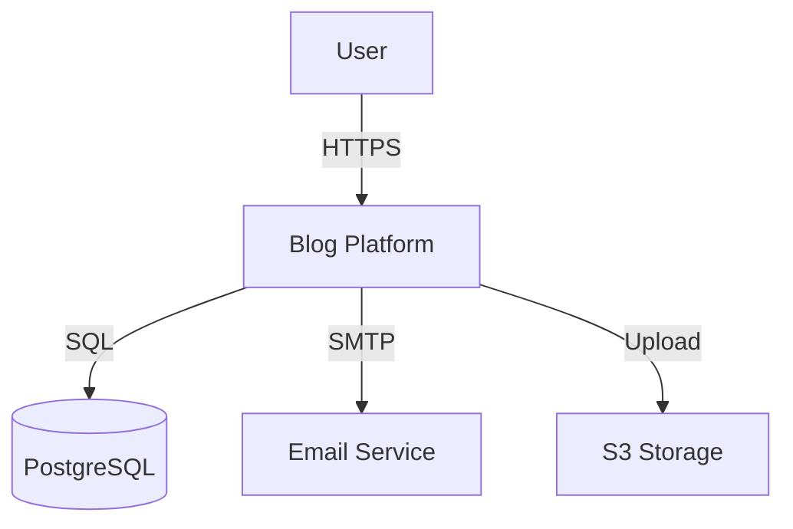
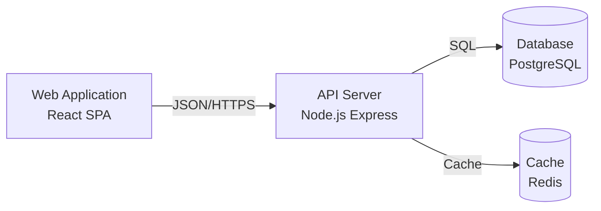
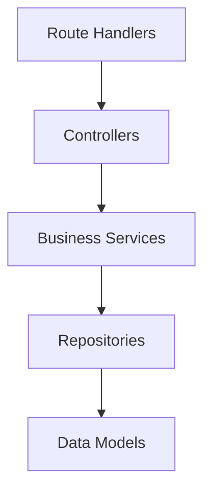
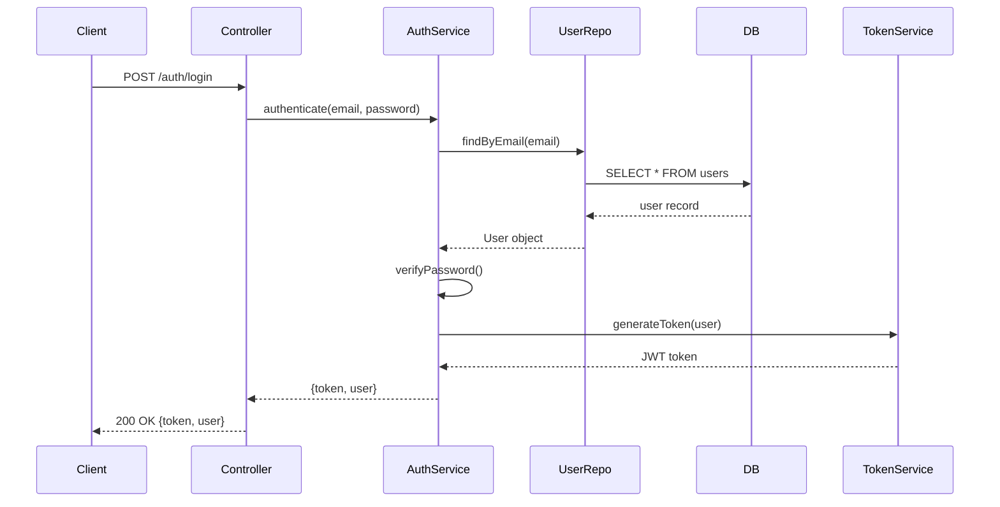

# Lab 004: Repository Analysis

## Learning Objectives

By the end of this lab, you will be able to:
- Systematically analyze unfamiliar codebases
- Create comprehensive architecture documentation
- Identify technical debt and improvement opportunities
- Map dependencies and data flow
- Generate onboarding documentation
- Assess code quality and maintainability
- Create actionable improvement roadmaps

## Prerequisites

- Completion of Labs 001-003
- Understanding of software architecture patterns
- Familiarity with code analysis tools
- Access to a git repository
- 60-90 minutes to complete the lab

## Setup

1. Choose a repository to analyze (or use the provided sample):
```bash
# Option 1: Use your own project
cd /path/to/your/project

# Option 2: Clone a sample project
git clone https://github.com/gothinkster/node-express-realworld-example-app
cd node-express-realworld-example-app
```

2. Install analysis tools:
```bash
npm install -g cloc madge dependency-cruiser
```

3. Open Claude in a new conversation

## Exercise 1: Initial Repository Discovery (15 minutes)

### Objective
Quickly understand the purpose, structure, and technology stack of an unfamiliar repository.

### Instructions

**Step 1: Gather Basic Information**

Run these commands:
```bash
# Count lines of code
cloc . --exclude-dir=node_modules,dist,build

# View repository structure
tree -L 3 -I 'node_modules|dist|build' > structure.txt

# List dependencies
cat package.json | jq '.dependencies'

# View git history
git log --oneline --graph --all -20
```

**Step 2: First Analysis Prompt**

```
I need to understand this codebase quickly. Here's the information I've gathered:

Repository: [repository name]
Primary language: [from cloc output]
Lines of code: [from cloc output]

Directory structure:
[paste structure.txt]

Dependencies:
[paste key dependencies from package.json]

Recent commits:
[paste git log output]

README summary:
[paste README.md key points]

Please provide:
1. What is the primary purpose of this application?
2. What architecture pattern is being used? (MVC, microservices, layered, etc.)
3. What are the key technologies and frameworks?
4. What is the likely deployment target? (serverless, container, traditional server)
5. What are the main functional areas or modules?
6. Based on the structure, what are potential areas of concern?
7. Create a high-level system diagram description

Focus on what's immediately evident from the structure and dependencies.
```

**Step 3: Directory Deep Dive**

For each major directory, ask:

```
Analyze the [directory name] directory:

Files in this directory:
[paste ls -la output]

Sample file contents:
[paste 2-3 representative files]

Please explain:
1. What is the responsibility of this directory?
2. What patterns or conventions are being followed?
3. How does this directory interact with others?
4. Are there any anti-patterns or concerns?
5. What would be the typical workflow for adding new functionality here?
```

**Validation Checkpoint**:

After 15 minutes, you should have:
- [ ] Clear understanding of application purpose
- [ ] Identified architecture pattern
- [ ] Mapped main components and their responsibilities
- [ ] Listed key technologies
- [ ] Noted initial concerns or questions

### Solution Template

**Repository Analysis Summary**:

```markdown
# [Repository Name] Analysis

## Purpose
[One paragraph describing what the application does]

## Architecture
- Pattern: [MVC/Microservices/etc.]
- Layers: [Presentation, Business Logic, Data Access, etc.]

## Technology Stack
- Runtime: [Node.js 18, Python 3.11, etc.]
- Framework: [Express, Django, Spring Boot, etc.]
- Database: [PostgreSQL, MongoDB, etc.]
- Key Libraries: [List top 5-7]

## Project Structure
```
src/
├── controllers/    # HTTP request handlers
├── models/         # Data models and business logic
├── routes/         # API route definitions
├── middleware/     # Express middleware
├── services/       # Business logic layer
└── utils/          # Helper functions
```

## Key Findings
- [Finding 1]
- [Finding 2]
- [Finding 3]

## Questions for Further Investigation
- [Question 1]
- [Question 2]
```

### Key Takeaways
- Start with structure before diving into code
- Use automated tools to gather metrics quickly
- README and package.json reveal much about the project
- Recent commits show active development areas
- Directory organization reveals architecture decisions

## Exercise 2: Architecture Mapping (20 minutes)

### Objective
Create comprehensive architecture documentation from code analysis.

### Instructions

**Step 1: Identify Core Components**

```
Based on this codebase, identify and document all core components:

[Provide relevant source files]

For each component, describe:
1. Name and purpose
2. Key responsibilities
3. Dependencies (what it uses)
4. Dependents (what uses it)
5. External integrations
6. Configuration requirements

Create a component diagram showing relationships.
```

**Step 2: Map Data Flow**

```
Trace the data flow for this key user journey: [e.g., "User creates an account"]

Starting from:
[paste entry point file, e.g., routes/auth.js]

Following through:
[paste relevant controller, service, model files]

Document:
1. Step-by-step data flow from request to response
2. Transformations applied to data at each step
3. Validation points
4. External service calls
5. Database operations
6. Error handling at each layer

Create a sequence diagram showing the complete flow.
```

**Step 3: Dependency Analysis**

Generate dependency graph:
```bash
madge --image deps-graph.png src/
dependency-cruiser src/ --output-type dot | dot -T svg > dependencies.svg
```

Analyze with Claude:
```
Here's the dependency graph for this project:

[attach or describe deps-graph.png]

Circular dependencies found:
[paste output from: madge --circular src/]

Analyze:
1. Are there circular dependencies? (code smell)
2. Are there highly coupled modules?
3. Is the dependency direction correct? (e.g., services shouldn't depend on controllers)
4. Are there missing abstraction layers?
5. What refactoring would improve the dependency structure?
6. Create a dependency health report
```

**Step 4: Create Architecture Documentation**

```
Generate comprehensive architecture documentation for this codebase:

Components identified:
[list from previous analysis]

Data flows mapped:
[key user journeys]

Dependency analysis:
[findings from dependency review]

Create documentation including:
1. System Context Diagram (C4 Level 1)
2. Container Diagram (C4 Level 2)
3. Component Diagram (C4 Level 3)
4. Data Flow Diagrams for key operations
5. Deployment architecture
6. Technology decisions and rationale
7. Architecture Decision Records (ADRs) for major choices

Format as markdown with Mermaid diagrams where possible.
```

**Example Output**:

```markdown
# Architecture Documentation

## System Context



## Container Diagram



## Component Diagram - API Server



## Key Data Flows

### User Authentication Flow



## Architecture Decision Records

### ADR-001: Use JWT for Authentication

**Status**: Accepted

**Context**: Need stateless authentication for API

**Decision**: Use JWT tokens with RS256 signing

**Consequences**:
- Positive: Stateless, scalable, standard
- Negative: Cannot revoke tokens before expiry
- Mitigation: Short expiry times + refresh tokens

### ADR-002: Layered Architecture

**Status**: Accepted

**Context**: Need clear separation of concerns

**Decision**: Routes → Controllers → Services → Repositories

**Consequences**:
- Positive: Testable, maintainable, clear boundaries
- Negative: More files, some boilerplate
```

**Validation Checkpoint**:
- [ ] All major components documented
- [ ] Data flows traced and visualized
- [ ] Dependencies mapped and analyzed
- [ ] Architecture diagrams created
- [ ] Key decisions documented

### Solution

A complete architecture document provides:
1. Visual representations (diagrams)
2. Component responsibilities
3. Data flow documentation
4. Dependency mapping
5. Decision rationale

### Key Takeaways
- Architecture emerges from code structure
- Diagrams make relationships clear
- Data flow tracing reveals design patterns
- Dependency analysis exposes coupling issues
- Documentation should be visual and concise

## Exercise 3: Code Quality Assessment (20 minutes)

### Objective
Systematically assess code quality and identify improvement areas.

### Instructions

**Step 1: Automated Quality Metrics**

Run analysis tools:
```bash
# Code complexity
npx eslint src/ --format json > eslint-report.json

# TypeScript/JavaScript specific
npx ts-prune  # Find unused exports

# Security audit
npm audit

# Test coverage
npm test -- --coverage
```

**Step 2: Quality Analysis Prompt**

```
Assess the code quality of this repository:

Metrics:
- Lines of code: [from cloc]
- Test coverage: [from coverage report]
- ESLint violations: [from eslint report]
- Security vulnerabilities: [from npm audit]
- Circular dependencies: [from madge]

Sample files representing different areas:
[paste 3-5 files from different modules]

Provide:
1. Overall code quality score (1-10 with justification)
2. Strengths of the codebase
3. Top 5 areas for improvement (prioritized)
4. Code smell analysis (GOF patterns violated)
5. Security concerns
6. Performance concerns
7. Maintainability index
8. Technical debt estimation (hours to address)
9. Recommended refactoring priorities

Structure the response as a code review report.
```

**Step 3: Deep Code Review**

Select a critical module and request detailed review:

```
Perform a thorough code review of this critical module:

[paste module code - e.g., authentication service]

Review criteria:
1. Correctness: Does it work as intended?
2. Security: Any vulnerabilities?
3. Performance: Any bottlenecks?
4. Maintainability: Is it easy to understand and modify?
5. Testability: Can it be tested easily?
6. Error handling: Are errors handled properly?
7. Documentation: Is it well-documented?
8. Best practices: Does it follow language/framework conventions?

For each issue found:
- Severity: Critical/High/Medium/Low
- Category: Security/Performance/Maintainability/etc.
- Description: What's wrong
- Impact: What could go wrong
- Recommendation: How to fix
- Example: Show corrected code
```

**Step 4: Generate Quality Report**

```
Create a comprehensive code quality report:

Repository: [name]
Analysis date: [date]
Analyzed by: Claude + [your name]

Include:
1. Executive Summary (1 paragraph)
2. Quality Metrics Dashboard
3. Strengths and Positive Patterns
4. Issues by Category and Severity
5. Technical Debt Inventory
6. Refactoring Roadmap (prioritized)
7. Best Practice Recommendations
8. Security Recommendations
9. Performance Optimization Opportunities
10. Testing Strategy Recommendations

Format as a professional code quality report suitable for stakeholders.
```

**Example Quality Report**:

```markdown
# Code Quality Assessment Report

**Project**: RealWorld API
**Date**: 2026-05-05
**Analyzer**: Claude Sonnet 4.5 + Development Team

## Executive Summary

The codebase demonstrates good adherence to Express.js patterns with clear separation of concerns. Overall quality score: **7.5/10**. Main strengths include consistent code style and comprehensive test coverage (84%). Primary improvement areas are error handling, input validation, and database query optimization.

## Quality Metrics

| Metric | Value | Target | Status |
|--------|-------|--------|--------|
| Lines of Code | 3,247 | - | ✓ |
| Test Coverage | 84% | >80% | ✓ |
| ESLint Violations | 23 | <10 | ⚠️ |
| Security Vulnerabilities | 2 (Low) | 0 | ⚠️ |
| Cyclomatic Complexity (avg) | 4.2 | <5 | ✓ |
| Code Duplication | 3% | <5% | ✓ |
| Technical Debt Ratio | 12% | <10% | ⚠️ |

## Strengths

1. **Consistent Architecture**: Clear layering with routes → controllers → services
2. **Test Coverage**: Comprehensive unit and integration tests
3. **Code Style**: Consistent formatting and naming conventions
4. **Documentation**: Well-documented API endpoints
5. **Dependency Management**: Up-to-date dependencies

## Issues by Severity

### Critical (0)
None identified

### High (3)

#### H1: SQL Injection Vulnerability in Search
**Location**: `src/services/articleService.js:45`
**Issue**: Raw string concatenation in SQL query
```javascript
// Current (vulnerable)
const query = `SELECT * FROM articles WHERE title LIKE '%${searchTerm}%'`;

// Recommended (parameterized)
const query = 'SELECT * FROM articles WHERE title LIKE $1';
const params = [`%${searchTerm}%`];
```

#### H2: Missing Rate Limiting
**Location**: `src/routes/auth.js`
**Issue**: No rate limiting on authentication endpoints
**Impact**: Vulnerable to brute force attacks
**Recommendation**: Implement express-rate-limit

#### H3: Unhandled Promise Rejections
**Location**: Multiple files
**Issue**: 15 instances of promises without .catch() handlers
**Impact**: Application crashes on errors
**Recommendation**: Implement global error handler

### Medium (8)

#### M1: Inconsistent Error Handling
**Files**: 12 files in services/
**Issue**: Mix of throw, return error, callback patterns
**Recommendation**: Standardize on async/await with try/catch

#### M2: Missing Input Validation
**Location**: `src/controllers/userController.js`
**Issue**: Trusting client input without validation
**Recommendation**: Use Joi or class-validator

[... additional issues ...]

## Technical Debt Inventory

| Item | Effort | Priority | Impact |
|------|--------|----------|--------|
| Implement input validation | 16h | High | Security, Stability |
| Add rate limiting | 4h | High | Security |
| Refactor error handling | 20h | Medium | Maintainability |
| Optimize N+1 queries | 12h | Medium | Performance |
| Add API documentation | 8h | Low | Developer Experience |

**Total Estimated Effort**: 60 hours

## Refactoring Roadmap

### Phase 1: Security (Priority: Critical, Duration: 1 week)
1. Fix SQL injection vulnerabilities
2. Implement rate limiting
3. Add input validation
4. Update dependencies with vulnerabilities

### Phase 2: Stability (Priority: High, Duration: 1 week)
1. Standardize error handling
2. Add global error middleware
3. Implement circuit breakers for external calls

### Phase 3: Performance (Priority: Medium, Duration: 2 weeks)
1. Optimize database queries
2. Implement caching layer
3. Add database indexes

### Phase 4: Maintainability (Priority: Low, Duration: 1 week)
1. Refactor large functions
2. Extract duplicate code
3. Improve test coverage to 90%

## Recommendations

### Immediate Actions
1. Fix SQL injection vulnerability (today)
2. Implement rate limiting (this week)
3. Add input validation (this sprint)

### Short-term (1 month)
1. Standardize error handling
2. Optimize database queries
3. Improve test coverage

### Long-term (3 months)
1. Implement monitoring and alerting
2. Add comprehensive API documentation
3. Refactor for better testability

## Conclusion

The codebase is in good shape overall with clear patterns and good test coverage. Addressing the identified security issues should be the immediate priority. Following the refactoring roadmap will significantly improve code quality and maintainability.

**Next Review**: 3 months
```

**Validation Checkpoint**:
- [ ] Quality metrics collected
- [ ] Issues categorized by severity
- [ ] Technical debt quantified
- [ ] Roadmap prioritized
- [ ] Actionable recommendations provided

### Solution

A comprehensive quality assessment includes:
1. Automated metrics for objectivity
2. Manual code review for context
3. Severity-based prioritization
4. Estimated effort for planning
5. Phased roadmap for execution

### Key Takeaways
- Combine automated tools with manual review
- Prioritize by impact and effort
- Quantify technical debt
- Provide actionable recommendations
- Create realistic roadmaps

## Exercise 4: Onboarding Documentation (15 minutes)

### Objective
Create comprehensive onboarding documentation for new developers.

### Instructions

**Prompt for Onboarding Guide**:

```
Create a comprehensive onboarding guide for new developers joining this project:

Repository: [name]
Primary technologies: [list]
Architecture pattern: [pattern]
Team size: [if known]

Generate:

1. **Getting Started** (15 minutes)
   - Prerequisites and installations
   - Repository setup
   - First successful run
   - Access to required services

2. **Architecture Overview** (30 minutes)
   - High-level system design
   - Key components and their roles
   - Data flow for common operations
   - Important conventions

3. **Development Workflow** (30 minutes)
   - Branch strategy
   - Commit message conventions
   - Code review process
   - Testing requirements
   - Deployment process

4. **Common Tasks** (60 minutes)
   - Adding a new API endpoint
   - Adding a new database model
   - Adding a new service
   - Writing tests
   - Debugging tips

5. **Project Standards**
   - Code style guide
   - Testing standards
   - Documentation requirements
   - Security guidelines
   - Performance considerations

6. **Troubleshooting**
   - Common setup issues
   - FAQ
   - Where to get help

7. **Additional Resources**
   - Links to docs
   - Related repositories
   - Team contacts

Make it practical with specific commands, code examples, and clear explanations.
```

**Validation Checkpoint**:
- [ ] New developer can set up in <30 minutes
- [ ] Common tasks are documented with examples
- [ ] Standards and conventions are clear
- [ ] Troubleshooting covers common issues
- [ ] Resources are easily accessible

### Solution

**Example Onboarding Guide**:

```markdown
# Developer Onboarding Guide

Welcome to the RealWorld API project! This guide will get you up and running.

## Getting Started (15 minutes)

### Prerequisites
- Node.js 18+ ([install](https://nodejs.org/))
- PostgreSQL 14+ ([install](https://www.postgresql.org/download/))
- Git ([install](https://git-scm.com/downloads))

### Repository Setup

1. Clone the repository:
```bash
git clone https://github.com/company/realworld-api.git
cd realworld-api
```

2. Install dependencies:
```bash
npm install
```

3. Set up environment:
```bash
cp .env.example .env
# Edit .env with your local database credentials
```

4. Set up database:
```bash
npm run db:create
npm run db:migrate
npm run db:seed
```

5. Start development server:
```bash
npm run dev
```

6. Verify it works:
```bash
curl http://localhost:3000/api/health
# Should return: {"status":"ok"}
```

## Architecture Overview (30 minutes)

[Include architecture diagrams from Exercise 2]

## Common Tasks

### Adding a New API Endpoint

1. Create route in `src/routes/`:
```javascript
// src/routes/products.js
router.get('/products/:id', auth.required, productController.getProduct);
```

2. Create controller in `src/controllers/`:
```javascript
// src/controllers/productController.js
exports.getProduct = async (req, res, next) => {
  try {
    const product = await productService.findById(req.params.id);
    res.json({ product });
  } catch (error) {
    next(error);
  }
};
```

3. Create service in `src/services/`:
```javascript
// src/services/productService.js
exports.findById = async (id) => {
  const product = await Product.findByPk(id);
  if (!product) {
    throw new NotFoundError('Product not found');
  }
  return product;
};
```

4. Add tests:
```javascript
// src/controllers/productController.test.js
describe('GET /api/products/:id', () => {
  it('should return product when found', async () => {
    const res = await request(app)
      .get('/api/products/1')
      .expect(200);
    
    expect(res.body.product).toBeDefined();
  });
});
```

5. Run tests:
```bash
npm test
```

[... additional common tasks ...]

## Troubleshooting

### Database Connection Failed
**Error**: `ECONNREFUSED 127.0.0.1:5432`
**Solution**: 
1. Ensure PostgreSQL is running: `pg_ctl status`
2. Check credentials in `.env`
3. Verify database exists: `psql -l`

[... additional troubleshooting ...]
```

### Key Takeaways
- Onboarding docs reduce time-to-productivity
- Include specific commands and examples
- Document common tasks step-by-step
- Provide troubleshooting for known issues
- Keep it updated as the project evolves

## Common Issues and Troubleshooting

### Issue 1: Large Repository Analysis Takes Too Long

**Solution**:
- Analyze in increments (directory by directory)
- Focus on critical paths first
- Use automated tools for metrics
- Summarize findings iteratively

### Issue 2: Inconsistent Coding Patterns

**Solution**:
- Document the inconsistency
- Propose standardization
- Create linting rules
- Refactor incrementally

### Issue 3: Missing Documentation

**Solution**:
- Generate from code analysis
- Interview existing developers
- Document as you learn
- Use code comments as source

## Extensions for Advanced Learners

### Extension 1: Automated Analysis Pipeline

Create a CI/CD step that:
1. Runs code quality tools
2. Generates metrics reports
3. Tracks quality over time
4. Fails build on regression

### Extension 2: Interactive Architecture Diagrams

Use tools like:
- PlantUML for diagrams as code
- Structurizr for C4 models
- Mermaid in GitHub/Markdown
- D2 for declarative diagrams

### Extension 3: Technical Debt Dashboard

Build a dashboard showing:
- Quality metrics over time
- Technical debt inventory
- Refactoring progress
- Team velocity impact

## Summary

You've learned to:
- Quickly understand unfamiliar codebases
- Create comprehensive architecture documentation
- Assess code quality systematically
- Generate onboarding documentation
- Map dependencies and data flows
- Identify improvement opportunities

## Next Steps

1. Analyze a real production codebase
2. Create architecture docs for your project
3. Build automated quality analysis pipeline
4. Proceed to Lab 005: Feature Development

---

**Lab Completion**: You've completed Lab 004. You can now analyze and document any codebase effectively using Claude as your analysis partner.
